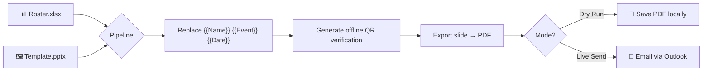
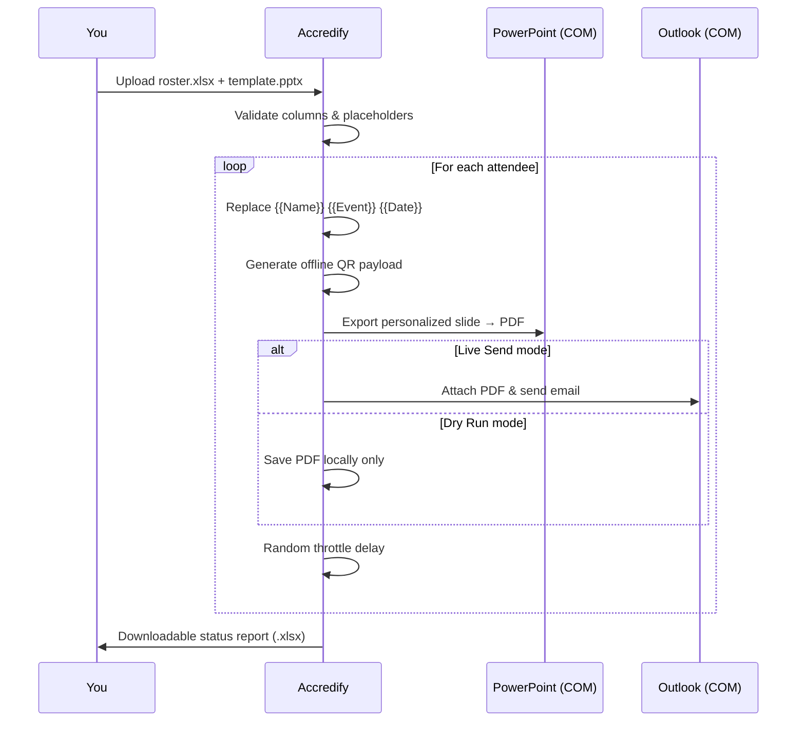
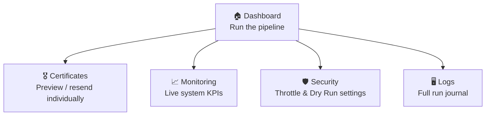

<div align="center">

# 🎓 Accredify
### Certificate Automation Suite

**Turn a spreadsheet and a slide into hundreds of personalized, QR‑verified certificates — automatically emailed, in minutes.**


</div>

---

## 📌 What is Accredify?

Accredify is a **Streamlit dashboard** that turns a boring, manual chore — *"open the template, change the name, save as PDF, attach it, email it, repeat 300 times"* — into a **one‑click pipeline**.

You give it two things:

| Input | What it is |
|---|---|
| 📊 **Roster** (`.xlsx`) | A spreadsheet of attendees with `First Name`, `Last Name`, `Email ID` |
| 🖼️ **Template** (`.pptx`) | A single PowerPoint slide with `{{Name}}`, `{{Event}}`, `{{Date}}` placeholders |

It hands back a **personalized, QR‑embedded PDF certificate per attendee** — either saved locally (Dry Run) or emailed straight from your Outlook inbox (Live Send).



---

## 🧭 Framework Philosophy

Accredify is built on a simple, deliberate idea: **use the tools people already trust, don't reinvent them.**

- **PowerPoint is the design tool** — non‑technical event teams already know how to design a certificate in PPTX. Accredify never asks anyone to learn a new design format; it just swaps placeholder text on the slide you already made.
- **Excel is the source of truth** — no databases, no CSV quirks to fight with. If you can list names in a spreadsheet, you can run a batch.
- **Verification is offline by design** — instead of embedding a link to some server that might disappear in five years, the QR code encodes the *entire* verification record as plain text. Scan it with any camera, on any device, forever — no server, no hosting cost, no dead links.
- **Automation reuses real desktop apps, not re‑implementations** — PDF export happens by driving the *actual* PowerPoint installed on your machine (via COM automation), and email is sent through the *actual* Outlook you're logged into. This means what you see in the preview is exactly what gets sent — pixel for pixel, mailbox for mailbox.
- **Safety over speed** — a randomized throttle between sends and a mandatory Dry Run mode exist so a bulk run never becomes an accidental spam blast or a silently botched job.

In short: **Accredify is glue, not a replacement.** It orchestrates PowerPoint, Excel, and Outlook — tools your team already trusts — instead of asking anyone to change how they work.

---

## ✨ Features

| | |
|---|---|
| 🖥️ **Enterprise Dashboard UI** | A dark, Fluent/Azure‑Portal‑inspired interface with a guided 5‑step wizard: *Event Details → Upload Files → Validation → Preview → Execute* |
| 🧩 **Live Placeholder Validation** | Instantly flags whether your uploaded template actually contains `{{Name}}`, `{{Event}}`, `{{Date}}` before you waste a run |
| 🔍 **Per‑Attendee Preview** | Render, download, or resend *one* attendee's certificate on demand — without running the whole batch |
| 🔐 **Offline QR Verification** | Every certificate embeds a self‑contained, scannable verification card — no internet or server required to verify authenticity |
| 🧪 **Dry Run Mode** | Generate every PDF locally with zero emails sent — the safe way to test a new template or roster |
| 🐢 **Safe‑Mode Throttling** | Randomized delay between sends to avoid tripping Outlook/anti‑spam rate limits |
| 📈 **Live Monitoring** | Real‑time KPI cards for Office COM status, template validity, roster status, and overall readiness |
| 🖥️ **System Journal** | A running log of every pipeline stage — generation, QR embedding, export, send — for full auditability |
| 📄 **Downloadable Run Report** | Every batch run produces an `.xlsx` status report (Sent / Dry Run / Failed) per attendee |

---

## 🏗️ How a Batch Run Works



---

## 🧰 Tech Stack

| Layer | Technology | Purpose |
|---|---|---|
| UI / App Framework | `streamlit >= 1.37.0` | Dashboard, forms, live logs, modals |
| Data Handling | `pandas >= 2.0.0`, `numpy >= 1.26.0` | Roster parsing & result tables |
| Spreadsheet I/O | `openpyxl >= 3.1.2` | Reading `.xlsx` rosters, writing `.xlsx` reports |
| Slide Manipulation | `python-pptx >= 0.6.23` | Reading/writing placeholders in the `.pptx` template |
| QR Generation | `qrcode[pil] >= 7.4.2` | Offline verification QR codes |
| Image Handling | `Pillow >= 10.0.0` | QR image rendering & compositing |
| Windows Automation | `pywin32 >= 306` *(Windows only)* | Driving real PowerPoint & Outlook via COM |

---

## ✅ Prerequisites

Because Accredify drives **real desktop PowerPoint and Outlook** (not a cloud API), it has a specific environment requirement:

- 🪟 **Windows 10 or 11**
- 🏢 **Microsoft Office** — the **classic desktop** PowerPoint *and* Outlook (⚠️ *not* the new standalone Outlook app — it doesn't support COM automation)
- 🐍 **Python 3.9+**

> Running on macOS/Linux, or without Office, still works for browsing the dashboard and validating files — but PDF export, previews, and email sending will be disabled (the app detects this automatically and shows "Office COM Unavailable").

---

## 🚀 Setup

### 1. Clone / download the project, then create a virtual environment

```bash
python -m venv venv
venv\Scripts\activate
```

### 2. Install dependencies

```bash
pip install -r requirements.txt
```

<details>
<summary>📄 <code>requirements.txt</code> (click to expand)</summary>

```
streamlit>=1.37.0
pandas>=2.0.0
numpy>=1.26.0
openpyxl>=3.1.2
python-pptx>=0.6.23
qrcode[pil]>=7.4.2
Pillow>=10.0.0
pywin32>=306; platform_system=="Windows"
```
</details>

### 3. Complete the one‑time `pywin32` setup

```bash
python venv\Scripts\pywin32_postinstall.py -install
```

### 4. Sign in to Outlook once

Open the **classic Outlook desktop app**, fully sign in, and leave it running *before* launching Accredify. This is what lets Accredify's COM bridge send mail on your behalf.

### 5. Launch the app

```bash
streamlit run certificate.py
```

Streamlit will open the dashboard in your browser (typically `http://localhost:8501`).

---

## 🎨 Theme

The dashboard's dark, enterprise look is driven entirely by `config.toml` — no code changes needed to re‑theme it:

```toml
[theme]
base = "dark"
primaryColor = "#6366F1"          # Indigo accent
backgroundColor = "#0B1120"       # Page background
secondaryBackgroundColor = "#151D2E"  # Cards / panels
textColor = "#E5E9F5"
font = "sans serif"
```

| Swatch | Hex | Role |
|---|---|---|
| 🟪 | `#6366F1` | Accent (buttons, active nav, highlights) |
| ⬛ | `#0B1120` | Base page background |
| ⬛ | `#151D2E` | Card / panel surface |
| ⬜ | `#E5E9F5` | Primary text |

Place `config.toml` inside a `.streamlit/` folder at your project root — Streamlit picks it up automatically.

---

## 📂 Preparing Your Files

Accredify is strict about two file formats so the automation never has to guess. Get these right and everything else is a click‑through wizard.

### 📊 Roster — `.xlsx`

Must contain **exactly** these column headers (case‑sensitive):

| First Name | Last Name | Email ID |
|---|---|---|
| Ada | Lovelace | ada@example.com |
| Alan | Turing | alan@example.com |

### 🖼️ Template — `.pptx`

A **single slide** containing the literal placeholder text:

```
{{Name}}      →  replaced with the attendee's full name
{{Event}}     →  replaced with your event name
{{Date}}      →  replaced with your event date
```

> ⚠️ **Reserve the bottom‑right corner.** A 1.3" × 1.3" area (0.3" margin from the edges) is automatically used for the QR code — keep that space visually clear in your design.

---

## 🖱️ Usage Walkthrough

Accredify's sidebar has five sections. Here's what each one does:



### 🏠 Dashboard — the 5‑step wizard

1. **Event Details** — enter Event Name & Event Date
2. **Upload Files** — drag in your `.xlsx` roster and `.pptx` template
3. **Validation** — Accredify checks your roster columns and template placeholders automatically, flagging anything missing
4. **Preview** — inspect the rendered slide before committing to a full run (via the *Layout Preview Workspace* tab)
5. **Execute** — hit run; watch a live terminal‑style log stream every stage (Generating PPTX → Replacing Placeholders → Embedding QR → Exporting PDF → Sending Email)

At the end, download a full **status report** (`.xlsx`) showing Sent / Dry Run / Failed per attendee.

### 🎖️ Certificates

A searchable, sortable table of every attendee in your roster with per‑row actions:

- 👁️ **Preview** — see the exact rendered certificate
- ⬇️ **Download** — get just that one PDF
- ✉️ **Resend** — re‑email a single certificate without rerunning the whole batch

### 📈 Monitoring

Live KPI cards for:
- Office COM connectivity (PowerPoint + Outlook)
- Template validity
- Roster status
- Overall system readiness (%)

### 🛡️ Security & Configuration

- **Safe‑Mode Throttle** — set min/max random delay (seconds) between sends
- **Dry Run Mode** — generate PDFs locally with **zero emails sent**; always test here first

### 🖥️ Logs

The exact log lines from your last pipeline run — timestamps, successes, failures — for auditing what happened and when.

---

## 🔐 How Verification Works

Every generated certificate embeds a QR code encoding a **self‑contained** verification card:

```
--- Accredify CERTIFICATE VERIFICATION ---
Status: Authentic Record
ID: IEEE-VIT-2026-0001
Issued To: Ada Lovelace
Event: TechFest 2026
Date: 05 July 2026
-----------------------------------------
```

Because the full record lives *inside* the QR code itself, verification works **offline, forever** — no server, database, or link that can go down or expire.

---

## 🐢 Safe Sending & Dry Runs

Sending hundreds of emails back‑to‑back is a great way to get throttled — or flagged as spam. Accredify avoids this with two safeguards:

- **Randomized delay** between each live send (configurable in Security)
- **Dry Run Mode**, which runs the *entire* pipeline — personalization, QR, PDF export — but stops just short of sending, so you can sanity‑check a batch with zero risk

> 💡 **Recommended flow:** always run a full batch in Dry Run first, spot‑check a few certificates in the Certificates tab, *then* switch to Live Send.

---

## ⚠️ Known UI Limitations

These are Streamlit platform constraints, honestly documented rather than hidden:

- The bottom action bar uses CSS `position: sticky`, not a true OS‑level docked footer — it may not persist over the sidebar or through some browsers' layout re‑flows
- The "Preview Template" button opens a modal dialog instead of jumping to the Layout Preview tab, since Streamlit has no public API to switch `st.tabs()` from code
- Sortable/sticky attendee table headers are hand‑built (fixed header + scroll container + sort dropdown), since `st.dataframe` doesn't yet support inline per‑row buttons
- Layout preview "zoom" is a display‑width slider on a rendered PNG, not true vector/DPI zoom

---

## 🛠️ Troubleshooting

| Symptom | Likely Cause | Fix |
|---|---|---|
| "Office COM Unavailable" | Not on Windows, or Office not installed | Run on Windows with classic PowerPoint + Outlook installed |
| PDF export fails silently | PowerPoint not licensed/activated | Open PowerPoint manually once to confirm it launches |
| Emails don't send | Using the new standalone Outlook app | Switch to **classic** Outlook desktop, sign in, keep it open |
| "Invalid class string" COM error | Known pywin32/Office quirk | Already handled — Accredify uses `Dispatch`, not `DispatchEx`, specifically to avoid this |
| Template flagged "Needs Review" | Missing `{{Name}}`, `{{Event}}`, or `{{Date}}` | Re‑check the exact placeholder text on your slide |
| Roster rejected | Column headers don't match exactly | Use `First Name`, `Last Name`, `Email ID` — verbatim |

---

<div align="center">

**Accredify** — because nobody should hand‑edit 300 certificates.

</div>
